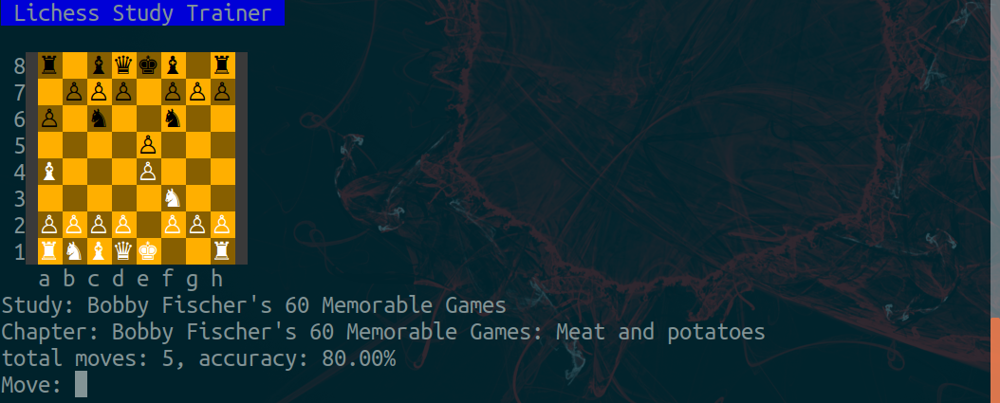

# lichess_study_trainer



Lichess study trainer is a cli tool developed with python to assist opening repertoire training of lichess studies. 

You can pick a user on lichess and train their studies move by move with a random feed from this tool. You can also access private studies with a lichess personal token.

## Dependencies
* [python-chess](https://python-chess.readthedocs.io/en/latest/index.html)
* [lichess API](https://lichess.org/api)
* [io](https://docs.python.org/3/library/io.html)
* [json](https://docs.python.org/3/library/json.html)
* [requests](https://docs.python-requests.org/en/latest/)
* [re](https://docs.python.org/3/library/re.html)
* [platform](https://docs.python.org/3/library/platform.html)

## Usage
Run with 

```python main.py```

If you want to access private studies, you need to generate a personal token on lichess, create a file called ```lichess_token.txt``` in the root directory and paste your lichess token into this file.

Lichess token can be generated at ```username -> preferences -> API access tokens```.
